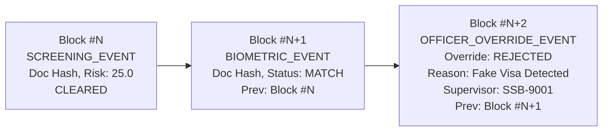

# BorderShield: Sovereign Privacy & Cryptographic Security Architecture

**Problem Statement**: Smart India Hackathon 2026 — PS 26188 (Ministry of Home Affairs - MHA)  
**System Designation**: Border Document Screening & E-Gate Identity Verification System  
**Compliance Mandates**: Digital Personal Data Protection (DPDP) Act 2023, Aadhaar Act 2016 (Section 29), ISO/IEC 19794-5 (Biometric Data Interchange), RFC 8785 (Canonical JSON), RFC 8032 (Ed25519 Cryptography), MeitY National Blockchain Framework (NBF Guidelines, Sept 2024).

---

## 1. Executive Summary & Privacy Principles

BorderShield is an automated document verification and e-gate identity screening platform designed for border checkpoints (such as Integrated Check Posts operated by the Sashastra Seema Bal - SSB and Bureau of Immigration - BoI). The system architecture enforces seven core sovereign privacy principles:

1. **Purpose Limitation**: Personal data is captured strictly for real-time identity authentication and border clearance at the physical e-gate portal.
2. **Data Minimization**: Only strictly required identity attributes (document number token, full name, nationality, date of birth, expiry date, facial embedding) are processed. Raw 576-dimensional biometric vectors, full Aadhaar numbers, and raw passport images are never exposed to public logs, audit ledgers, or external networks.
3. **Storage Minimization & Ephemeral Lifecycle**: Document scan artifacts and facial crops are scrubbed from disk after a configurable retention lifetime (`DOCUMENT_RETENTION_HOURS = 24`), unless explicitly flagged for judicial evidence (`legal_hold = True`).
4. **End-to-End Cryptographic Security**: All stored PII is encrypted at rest using authenticated symmetric cryptography (AES-256-GCM with 96-bit unique IVs). Lookups on sensitive numbers utilize keyed HMAC-SHA-256 tokens to prevent dictionary and inversion attacks.
5. **Zero-PII Sovereign Audit Ledger**: Local and distributed ledger blocks record only non-PII transaction identifiers, document hashes, risk scores, automated decisions, station provenance, and digital signatures.
6. **Asymmetric Officer Non-Repudiation**: Checkpoint screening events, biometric decisions, and officer overrides are signed using high-performance Ed25519 digital signatures (RFC 8032) bound to station keypairs.
7. **Offline-First Resilience & Graceful Degradation**: Border checkpoints operate continuously in complete isolation from external networks using local cryptographic chaining. In the event of wide-area network or central DLT latency, events are committed locally and spooled as `ANCHOR_PENDING` without halting traveler flow.

---

## 2. Cryptographic Architecture & Standards

### 2.1 Authenticated Field Encryption (AES-256-GCM)
Sensitive text fields (names, passport numbers, Aadhaar numbers, and operational notes) are protected at rest using **AES-256-GCM** (Galois/Counter Mode), providing both confidentiality and cryptographic integrity.

- **Standard**: FIPS 197, NIST SP 800-38D.
- **Key Length**: 256 bits (32 bytes), resolved from secure environment configuration or air-gapped HSM/KMS.
- **Nonce / IV**: 96-bit (12-byte) cryptographically secure pseudorandom nonce generated uniquely per encryption via `os.urandom(12)`.
- **Authentication Tag**: 128-bit (16-byte) GCM authentication tag appended to ciphertext.
- **Wire / Database Format**:
  ```
  enc:v1:<base64url_nonce>:<base64url_ciphertext_with_tag>
  ```
- **Tamper Protection**: Any bit modification in ciphertext or nonce causes an immediate `DecryptionError` (`InvalidTag` exception), alerting the system to tampering attempts.

### 2.2 Keyed Identifier Tokenization (HMAC-SHA-256)
Direct equality lookups in databases (such as blacklist checks or alias history queries) cannot be performed on encrypted fields without leaking patterns (ECB/CBC) or requiring full-table decryption scans. BorderShield implements keyed HMAC-SHA-256 tokenization for indexable identity matching.

- **Standard**: FIPS 198-1, RFC 2104.
- **Key Separation**: Dedicated `HMAC_SECRET_KEY` separate from the encryption key.
- **Input Normalization**: Identifiers are stripped of whitespace, dashes, slashes, and periods, and converted to uppercase prior to hashing.
- **Wire / Database Format**:
  ```
  tok:v1:<64_hex_hmac_digest>
  ```
- **Properties**: Deterministic for identical inputs under the same secret key, computationally irreversible (one-way), and immune to rainbow table / dictionary inversion attacks.

### 2.3 Biometric Template Protection (ISO/IEC 19794-5)
Face verification extracts a 576-dimensional L2-normalized float32 embedding vector using MobileNetV3-Small.
- **Encryption at Rest**: Raw 2304-byte embedding arrays are serialized to bytes and encrypted using `encrypt_bytes()` (AES-256-GCM).
- **Pseudonymized Identity Binding**: Biometric records are linked only to a random `subject_id` (`SUBJ-<UUID12>`), decoupling biometric features from traveler names.
- **Anti-Inversion**: Raw float32 vectors are never logged or returned in API payloads. Cosine distance evaluations are performed strictly in volatile memory.

### 2.4 Station Digital Signatures (Ed25519 / RFC 8032)
Every ledger block is digitally signed by the active Integrated Check Post station private key.
- **Standard**: RFC 8032, Edwards-curve Digital Signature Algorithm (EdDSA) using Curve25519 and SHA-512.
- **Key Length**: 32-byte private seed, 32-byte public key.
- **Performance**: Sub-millisecond signing (~0.18ms) and verification (~0.25ms), critical for real-time border gates.
- **Wire Format**:
  ```
  sig:ed25519:<128_hex_signature>
  ```
- **Guarantees**: Officer station provenance, data integrity of the canonical event digest, and non-repudiation.

---

## 3. Cryptographically Chained Audit Ledger Architecture

### 3.1 Design Philosophy: Ledger vs. Database
In accordance with Section 19 of `Security .md`, BorderShield strictly bifurcates database and ledger responsibilities:

| Responsibility | Operational Database (SQLite / PostgreSQL) | Audit Ledger (Merkle Chain / Vishvasya BaaS) |
| :--- | :--- | :--- |
| **Data Scope** | Document records, encrypted PII, biometric metadata, case details | Non-PII event digests, risk scores, decisions, officer IDs, signatures |
| **Mutability** | Managed by repository layer with retention lifecycle deletion | **Strictly append-only**: `UPDATE` and `DELETE` queries are prohibited |
| **Performance** | Rapid indexing, filtering, pagination | Cryptographic chain verification, provenance auditing, dispute resolution |
| **Storage Tier** | Local SSD / Centralized Government Relational DB | Local append-only SQLite table / National Blockchain Framework |

### 3.2 Canonical JSON Serialization (RFC 8785)
To guarantee deterministic cryptographic hashing across diverse platforms, programming languages, and node architectures, all audit events are serialized using **RFC 8785 (JSON Canonicalization Scheme - JCS)**:
- Object keys are lexicographically sorted by UTF-16 code units.
- Whitespace between tokens is completely omitted.
- Numbers and floats are rendered with IEEE 754 precision without trailing zeroes.
- Strings are encoded in strict UTF-8 without unnecessary escape sequences.

### 3.3 Event Sequence Model
Rather than mutating a single record through its lifecycle, BorderShield models inspections as an append-only sequence of immutable events:



1. **`SCREENING_EVENT`**: Appended upon document upload, OCR extraction, and forgery rule evaluation.
2. **`BIOMETRIC_EVENT`**: Appended upon completion of live face capture and 1:1 / 1:N biometric matching.
3. **`OFFICER_OVERRIDE_EVENT`**: Appended when an authorized supervisor or investigator overrides an automated decision. The historical automated screening decision is preserved untouched in earlier blocks.

---

## 4. Sovereign Role-Based Access Control (RBAC)

BorderShield enforces five sovereign roles across border checkpoint operations:

| Role | Operational Scope | Screening Access | PII Unmasking | Decision Override | Ledger Audit |
| :--- | :--- | :---: | :---: | :---: | :---: |
| **`SCREENING_OFFICER`** | Frontline booth operator | Yes | Masked (Sec 29) | No | View Recent |
| **`SUPERVISOR`** | Shift commander / ICP gate in-charge | Yes | Unmask Permitted | **Yes** | Full Verify |
| **`INVESTIGATOR`** | Border Intelligence / Forgery Unit | Yes | Unmask Permitted | **Yes** | Full Verify |
| **`AUDITOR`** | Independent MHA oversight officer | Read-only | Masked (Sec 29) | No | Full Verify & Export |
| **`SYSTEM_ADMIN`** | Checkpoint IT hardware administrator | Config Only | No | No | Infrastructure Only |

Authentication headers (`X-Officer-ID`, `X-Officer-Role`, `X-Station-ID`) are injected by the border checkpoint API gateway and verified in FastAPI dependencies. Unauthorized override attempts return HTTP 403 Forbidden.

---

## 5. Storage Lifecycle & Ephemeral Retention

To comply with Section 10 of `Security .md` and Section 8 of the DPDP Act 2023 (Storage Limitation):
1. **Magic-Byte Inspection**: Uploaded document images are verified against magic signatures (`\xFF\xD8\xFF` for JPEG, `\x89PNG` for PNG, `RIFF...WEBP` for WebP). Disguised executables and scripts are rejected immediately.
2. **Decompression Bomb Guard**: Image dimensions are checked upon decode. Images exceeding 50 Megapixels (`MAX_IMAGE_PIXELS = 50,000,000`) are rejected with HTTP 400.
3. **Payload Bounds**: Enforces `MAX_UPLOAD_SIZE_BYTES = 15,728,640` (15MB). Larger files return HTTP 413.
4. **Path Traversal Sanitization**: All filenames are passed through `sanitize_filename()` and stored under server-generated UUIDs (`uploads/<uuid>.<ext>`).
5. **Ephemeral Scrubber**: A background task periodically sweeps `backend/uploads/`. Files older than `DOCUMENT_RETENTION_HOURS` (default 24h) are permanently unlinked, unless pinned with `legal_hold = True`.

